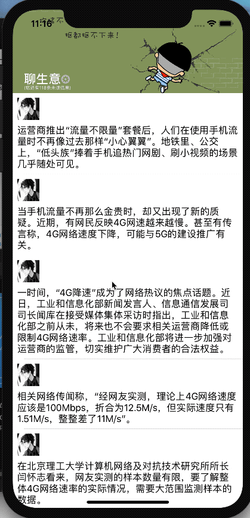

# NavigationAnimationDemo
导航栏的标题变化动画

# 效果图



# 目的

为了展示导航栏中的标题随着列表的滚动而发生改变，而且标题的内容也可能发生改变。
这里的实现方式采用了自定义导航栏和富文本。

# 核心代码如下：

### 带有图片的富文本实现代码片段：

```
- (void)updateBigTitle:(NSString *)strTitle
             imageName:(NSString *)imageName
{
    self.bigTitleLabel.text = strTitle;
    //1、初始化富文本对象
     NSMutableAttributedString *attributedString = [[NSMutableAttributedString alloc] initWithString:strTitle];

    NSRange rangeBig = NSMakeRange(0, 3);
    //2、修改富文本中的不同文字的样式
    [attributedString addAttribute:NSForegroundColorAttributeName value:[UIColor whiteColor] range:rangeBig];//字体颜色
    [attributedString addAttribute:NSFontAttributeName value:[UIFont boldSystemFontOfSize:22] range:rangeBig];//字体大小

    if (strTitle.length>3) {
        NSRange rangeSmall = NSMakeRange(3, strTitle.length-3);
        [attributedString addAttribute:NSForegroundColorAttributeName value:[UIColor whiteColor] range:rangeSmall];//字体颜色
        [attributedString addAttribute:NSFontAttributeName value:[UIFont systemFontOfSize:15] range:rangeSmall];//字体大小
    }

    if (imageName.length>0) {
        //3、初始化NSTextAttachment对象
        NSTextAttachment *attchment = [[NSTextAttachment alloc]init];
        attchment.bounds = CGRectMake(0, -1, 16, 16);//设置frame
        attchment.image = [UIImage imageNamed:imageName];//设置图片
        
        //4、创建带有图片的富文本
        NSAttributedString *string = [NSAttributedString attributedStringWithAttachment:(NSTextAttachment *)(attchment)];
        [attributedString insertAttributedString:string atIndex:3];//插入到第几个下标
    }
    
    //5、用label的attributedText属性来使用富文本
    self.bigTitleLabel.attributedText = attributedString;
    
    CGSize size = [attributedString boundingRectWithSize:CGSizeZero
                                                 options: NSStringDrawingUsesLineFragmentOrigin|NSStringDrawingUsesFontLeading
                                                 context:nil].size;
    // 这里的 6 主要和插入的图片画有关
    self.bigTitlesize = CGSizeMake(size.width, size.height+6);
}
```

### 滑动列表产生动画效果的代码片段：

```
- (void)scrollViewDidScroll:(UIScrollView *)scrollView
{
    float fallOffsetY = k_image_height-k_navbar_height;
    CGFloat offSetY = scrollView.contentOffset.y;
    
    float offSetYRatio = offSetY/fallOffsetY;
    if (offSetYRatio>0.43) {
        self.smallTitle.hidden = YES;
        [self updateBigTitle:@"聊生意(118)"
                   imageName:nil];
    }else {
        self.smallTitle.hidden = NO;
        [self updateBigTitle:@"聊生意"
                   imageName:@"setting"];
    }
    
    if (offSetY <=0 ) {
        scrollView.contentOffset = CGPointMake(0, 0);
        self.navigationView.alpha = 0;
        self.whiteBaseView.alpha = 0;
        self.headerBgImageView.transform = CGAffineTransformScale(CGAffineTransformIdentity, 1, 1);
        
        self.bigTitleLabel.frame = CGRectMake(k_title_left,
                                         k_image_height-k_title_bottom-self.bigTitlesize.height-self.self.smallTitlesize.height,
                                         self.bigTitlesize.width,
                                         self.bigTitlesize.height);
        self.bigTitleLabel.textColor = [UIColor whiteColor];
        
        self.smallTitle.textColor = self.bigTitleLabel.textColor;
    } else if (offSetY > fallOffsetY) {
        offSetY = fallOffsetY;
        self.navigationView.alpha = 1;
        self.whiteBaseView.alpha = 1;
        
        self.bigTitleLabel.frame = CGRectMake(k_title_left+offSetY/fallOffsetY*((k_screen_width-k_title_left*2-self.bigTitlesize.width)/2),
                                         k_statusbar_height,
                                         self.bigTitlesize.width,
                                         self.bigTitlesize.height);
        self.bigTitleLabel.textColor = [UIColor blackColor];
        
        self.smallTitle.textColor = self.bigTitleLabel.textColor;
    } else {
        self.navigationView.alpha = 0;
        self.bigTitleLabel.frame = CGRectMake(k_title_left+offSetY/fallOffsetY*((k_screen_width-k_title_left*2-self.bigTitlesize.width)/2),
                                         k_image_height-k_title_bottom-self.bigTitlesize.height-self.self.smallTitlesize.height-(k_image_height-k_title_bottom-k_statusbar_height- self.bigTitlesize.height-self.self.smallTitlesize.height)*offSetYRatio,
                                         self.bigTitlesize.width,
                                         self.bigTitlesize.height);
        float colorIndex = (k_color_count-offSetY/(fallOffsetY/k_color_count))*(255./k_color_count)/225.;
        self.bigTitleLabel.textColor = [UIColor colorWithRed:colorIndex green:colorIndex blue:colorIndex alpha:1];
        self.headerBgImageView.transform = CGAffineTransformScale(CGAffineTransformIdentity, 1+0.4*offSetYRatio, 1+0.2*offSetYRatio);
        self.whiteBaseView.alpha = offSetYRatio;
        
        self.smallTitle.textColor = self.bigTitleLabel.textColor;
        
    }
    
    [self updateSmallTitleFrame];
    [self.view bringSubviewToFront:self.bigTitleLabel];
}
```

# 总结

其实核心代码很简单，但是主要怎么计算，方式方法很重要。

当然，循规蹈矩，此类方法效果也可以在 `UIScrollView`、`UITableView`、`UICollectionView`等具有滑动性质的控件上实现。